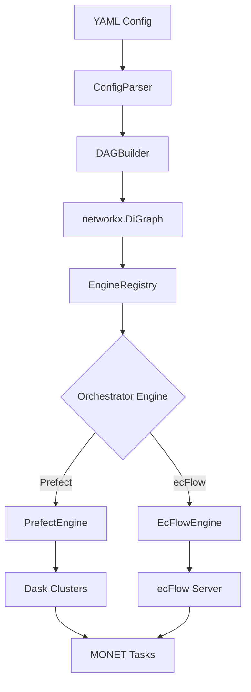
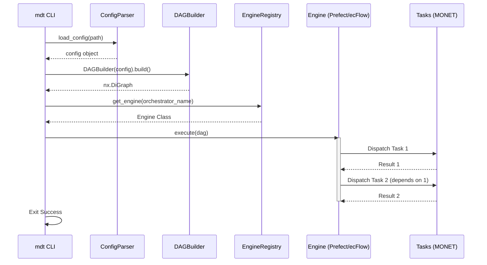

# Developer Guide

This guide is intended for developers who wish to contribute to MDT or understand its internal architecture.

## Architecture Overview

MDT is designed as a modular orchestration layer. It translates a declarative YAML configuration into a Directed Acyclic Graph (DAG) of tasks and then delegates the execution of those tasks to a pluggable orchestration engine (like Prefect or ecFlow).

The following diagram illustrates the high-level flow of an MDT execution:

## Core Components

### 1. Configuration Parsing (`mdt.config`)

The `ConfigParser` class is responsible for reading the YAML configuration, applying defaults, and performing initial validation. It ensures that the required sections (`data`, `execution`) exist and that task definitions are structurally sound.

### 2. DAG Construction (`mdt.dag`)

The `DAGBuilder` takes the validated configuration and constructs a `networkx.DiGraph`.
- **Nodes** represent tasks (loading, pairing, statistics, etc.).
- **Edges** represent data dependencies.
- **Attributes** on nodes store the parameters (kwargs) and execution requirements (e.g., cluster/partition).

### 3. Engine Abstraction (`mdt.engine_registry`)

MDT uses an abstract `Engine` class to decouple the workflow logic from the underlying orchestrator. This allows MDT to support diverse environments—from a researcher's laptop using Prefect/Dask to operational NOAA supercomputers using ecFlow.

### 4. Task Delegation (`mdt.tasks`)

MDT acts strictly as an orchestrator. It does not contain heavy scientific logic. Instead, it delegates to the MONET ecosystem.

#### VirtualiZarr Integration
For large-scale data handling, MDT integrates **VirtualiZarr**. When enabled in the `data` configuration, MDT uses `kerchunk` or `icechunk` to create a virtual Zarr representation of the source files. This allows the orchestrator to:
- Perform metadata-only discovery of massive datasets.
- Distribute data-parallel tasks more efficiently across Dask workers.
- Avoid expensive data conversion or staging steps.

The primary delegation remains:
- **Data Loading**: `monetio`
- **Pairing**: `monet`
- **Statistics**: `monet-stats`
- **Plotting**: `monet-plots`

## Execution Sequence

The following sequence diagram shows the interaction between components during a `mdt run` command:

## Adding New Features

### Adding a New Task Type
1. Define the core logic in a new or existing module in `src/mdt/tasks/`.
2. Update `src/mdt/dag.py` to recognize the new configuration section and add corresponding nodes to the graph.
3. Update the Engine implementations (`src/mdt/engine.py` and `src/mdt/ecflow_engine.py`) to handle the new task type.

### Adding a New Engine
1. Subclass `mdt.engine_registry.Engine`.
2. Implement the `execute()` method to translate the NetworkX DAG into the new orchestrator's native format.
3. Register the new engine in `src/mdt/engine_registry.py`.
